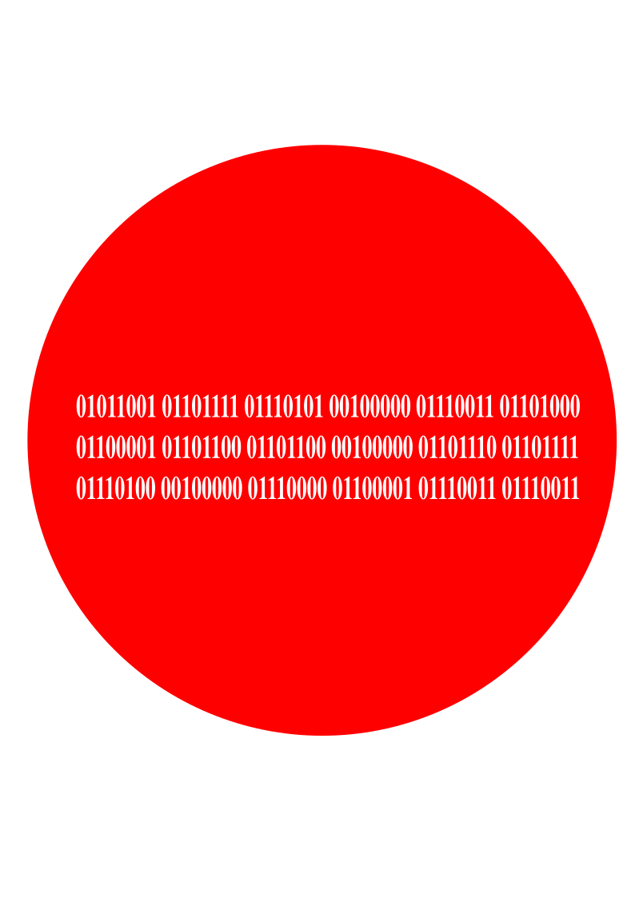
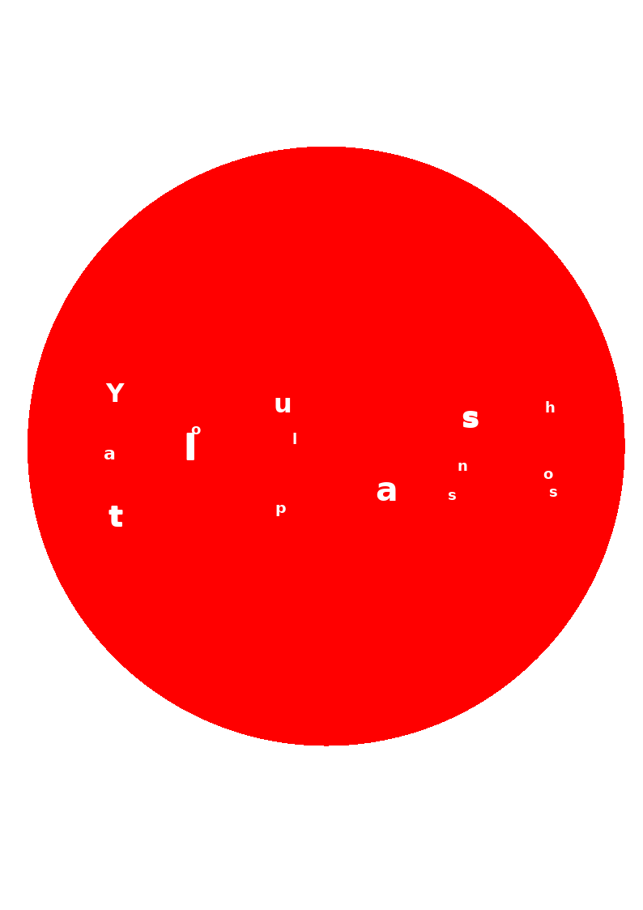

# DrawMeBinary

A command-line tool and web app that reads binary (0/1) text hidden inside hand-painted or printed artwork and re-renders it as a clean typographic layout or a scattered poster, keeping the original background.

Painted or printed binary digits are found anywhere in an image, classified, decoded to text (ASCII / UTF-8, EN + ES), and drawn back over the artwork — at the positions the bits occupied, in the colours they were painted with.

**Live demo:** https://huggingface.co/spaces/Pfffs/DrawMeBinary

---

## Examples

`test_stop.png` — "You shall not pass" encoded as 8-bit ASCII over a red circle. Input, basic render, poster render:

| Input | Basic | Poster |
|-------|-------|--------|
|  |  |  |

---

## How it works

The pipeline (`drawmebinary/pipeline.py`) has three stages:

1. **Extraction** (`extraction.py`)
   - *Ink mask*: pixels that differ from the local background (colour median blur). One pass, any ink/background colour combination.
   - *Components*: glyph-sized connected components, filtered by size, ink/surround contrast, height consistency and line structure. Components that merge with a colour boundary are salvaged by removing dominant background colours; runs of touching digits are split at ink minima.
   - *Classification*: one Tesseract pass finds caption words (real letters, kept as passthrough text). Every bit is then classified **geometrically** — enclosed hole = 0, narrow stem = 1 — with an optional Keras MNIST verifier and targeted OCR as tie-breakers.
   - *Colour streams*: ink colours cluster into independent text streams.

2. **Decoding** (`decoding.py`) — per colour stream:
   - glyphs group into line bands, lines split into tokens at gaps;
   - 8-bit tokens decode directly (UTF-8, latin-1 fallback);
   - 4-bit tokens pair column-wise with the next line (top = high nibble), covering stacked nibble rows and vertical columns;
   - damaged tokens are skipped and damaged lines repaired by an error-tolerant decoder that survives an inserted, lost or flipped digit; a flat bitstream decode is the fallback for unstructured layouts;
   - both nibble orders and several line-join strategies are decoded and an EN/ES language score picks the winner;
   - per-colour streams compete against a unified colour-agnostic reading.

3. **Rendering** (`rendering.py`)
   - every detected glyph is inpainted away, so the artwork's shapes and colours survive while the painted bits disappear;
   - **basic** mode draws each decoded character at the centre of the 0/1 group that encoded it, in the stream's ink colour;
   - **poster** mode scatters each character near its source bits with a random font and boldness.

---

## Installation

```bash
pip install -r requirements.txt
```

Tesseract must also be installed on the host system:

```bash
# macOS
brew install tesseract

# Ubuntu / Debian
sudo apt install tesseract-ocr
```

The Keras MNIST verifier is optional. It is only used if `tensorflow` is installed and a `mnist_binary_verifier.keras` file is present in the project root; generate one with `python drawmebinary/train_model.py`. Everything works without it.

---

## Usage

Run from the project root:

```bash
# Basic mode — text re-drawn at the original bit positions
python drawmebinary/main.py test/test_stop.png -b

# Poster mode — scattered artistic layout, random fonts
python drawmebinary/main.py test/test_stop.png -p

# Apply a config preset
python drawmebinary/main.py test/test_stop.png -b --preset dense

# Save extracted binary and text to output/text/
python drawmebinary/main.py test/test_stop.png -b --save-text

# PDFs: every page is rasterised and processed in turn
python drawmebinary/main.py path/to/file.pdf -p --pdf-dpi 200

# A folder: every image inside is processed
python drawmebinary/main.py test -b
```

Output images are saved to `output/` with a timestamp suffix.

### Web UI

A browser UI for drag-drop upload, before/after preview, and download:

```bash
python webapp/app.py        # then open http://127.0.0.1:5000
```

Or use the live deployment on Hugging Face Spaces: https://huggingface.co/spaces/Pfffs/DrawMeBinary

### Docker

```bash
docker build -t drawmebinary .
docker run --rm -p 7860:7860 drawmebinary
# open http://localhost:7860
```

---

## Supported encodings

| Layout | Example | Decoding |
|--------|---------|----------|
| 8-bit lines | `01011001 01101111 ...` | one byte per token, reading order |
| Stacked nibble rows | `0100 0100` over `0001 1001` | column-wise pairs → `AI` |
| Vertical nibble column | one 4-bit group per line | consecutive line pairs → bytes |
| Mixed + captions | letters around encoded words | letters pass through, position-ordered |
| Multiple colours | each colour = one stream | streams decode and render separately |

Spanish text (á é í ñ …) is handled via latin-1 / UTF-8 fallback and an ES dictionary in the decode vote.

---

## Config presets

Defined in `drawmebinary/config.py`:

| Preset  | Effect |
|---------|--------|
| `sparse`  | Large, bold characters — for images with few characters |
| `dense`   | Small, tight characters — for images with many characters |
| `bw`      | Tunes extraction for faint greyscale grids |
| `story`   | Compact, readable sizing — for long narrative text |

Every tunable parameter lives in `config.py`. The pipeline contains no per-image logic.

---

## Security

The hidden message and the file carrying it are treated as untrusted data throughout. `drawmebinary/security.py` hardens every boundary.

| Guard | What it does |
|-------|--------------|
| Input validation | Magic-byte check: the file must really be a PNG/JPEG/BMP/TIFF/PDF. Executables, scripts and archives are refused outright. |
| Resource limits | File-size cap, image dimension/pixel caps (decompression-bomb guard), PDF page cap. |
| PDF active content | Scanned for JavaScript, Launch actions, embedded files. Never executed — pages are only rasterised to pixels. |
| Decoded-text safety | ANSI escape sequences stripped; control characters become visible escapes before printing or saving. |
| Code detection | If the decoded message looks like code (shell commands, SQL injection, PowerShell, HTML/JS …), it is flagged — and still rendered as inert plain text, never evaluated. |
| Output containment | Output filenames sanitized; output paths cannot escape the output directory. |
| No dynamic execution | No eval/exec/compile, no os.system, no subprocess, no pickle anywhere in the source. Audited by the test suite on every run. |

---

## Security logging & observability

The web app emits **standardized security events** in real time (full schema in [SECURITY_LOGGING.md](SECURITY_LOGGING.md)):

- `drawmebinary/seclog.py` — a reusable, dependency-free logger emitting **ECS 8.11** JSON to stdout and a rotating file. A per-request `trace.id` ties all events of one request together. Secrets are scrubbed; decoded content is **never logged**, only a SHA-256 hash.
- A stable event taxonomy covers the full request lifecycle: received, completed, validation refused, rate limit exceeded, decode completed, code detected.
- A small in-memory per-IP sliding-window rate limiter is built into the web app.
- **Grafana Cloud Loki** integration: set `LOKI_URL`, `LOKI_USER`, and `LOKI_TOKEN` as environment variables and every event is shipped in real time via a non-blocking background handler. Use LogQL to query refusal spikes, code-payload probing, and rate-limit abuse.
- `siem/` — a local SIEM alternative using **Vector → OpenSearch → Dashboards** (`docker compose -f siem/docker-compose.yml up -d`). See [siem/README.md](siem/README.md).

Any future app can `import seclog` with its own `service.name` and land in the same schema and dashboards.

---

## GDPR / Privacy

The web app and its logging are designed to be GDPR-compliant by default:

- **No image persistence** — uploads run in a temp directory deleted before the response returns.
- **No content logging** — decoded text is never stored; only a SHA-256 hash is logged.
- **Pseudonymised IPs** — source IPs are truncated to `/24` by default (host bits zeroed). Hash mode is available via `DMB_LOG_IP_MODE=hash` with a secret salt set in `DMB_LOG_IP_SALT`.
- **Minimal user agent** — only browser family (e.g. `Safari/605`) is logged, not the full UA string.
- **Retention** — Grafana Cloud free tier retains logs for 14 days, documented in the UI privacy notice.
- **EU data residency** — the Grafana Cloud Loki endpoint used is in the EU West region.

Lawful basis: legitimate interest (Article 6(1)(f)) for security monitoring.

---

## Environment variables

| Variable | Default | Description |
|----------|---------|-------------|
| `DMB_ENV` | `development` | Environment tag on log events |
| `DMB_LOG_IP_MODE` | `truncate` | IP storage mode: `full`, `truncate`, or `hash` |
| `DMB_LOG_IP_SALT` | *(empty)* | Secret salt for hash mode — set as a secret, never commit |
| `LOKI_URL` | *(unset)* | Grafana Cloud Loki push endpoint |
| `LOKI_USER` | *(unset)* | Grafana Cloud numeric user ID |
| `LOKI_TOKEN` | *(unset)* | Grafana Cloud API token with `logs:write` scope |

---

## Project layout

```
DrawMeBinary/
├── drawmebinary/        All Python source
│   ├── main.py          CLI entry point (images, PDFs, folders)
│   ├── pipeline.py      extract -> decode in one call
│   ├── config.py        CONFIG dict and PRESETS (all tunables)
│   ├── extraction.py    Ink mask, glyph segmentation, 0/1 classification
│   ├── decoding.py      Line/token grouping, format detection, lang scoring
│   ├── rendering.py     Background inpainting; basic + poster modes
│   ├── security.py      Input validation, sanitizing, code detection
│   ├── seclog.py        ECS security logging (SIEM-ready, reusable)
│   ├── tests.py         pytest suite (unit + integration)
│   └── train_model.py   Optional Keras 0/1 verifier training
├── webapp/              Flask web UI (instrumented, rate-limited, GDPR-compliant)
│   ├── app.py
│   └── templates/index.html
├── siem/                Local SIEM demo (Vector + OpenSearch + Dashboards)
│   ├── docker-compose.yml
│   ├── vector.toml
│   └── README.md
├── examples/            Sample input + basic/poster renders
├── test/                Input images (ships with test_stop.png)
├── Dockerfile           Production image for Hugging Face Spaces / Docker
├── SECURITY_LOGGING.md  Log schema, event taxonomy, privacy design
├── test_fixtures.json   Expected decodes for the test suite
├── requirements.txt
├── pytest.ini
└── LICENSE
```

---

## Running tests

```bash
pytest drawmebinary/tests.py -v                       # everything
pytest drawmebinary/tests.py -v -m "not integration"  # unit tests only
pytest drawmebinary/tests.py -v -m integration        # test/ images
python drawmebinary/tests.py --smoke                  # quick smoke test
```

---

## Known limitations

- Glyphs straddling a hard colour boundary can occasionally drop a bit. Damaged tokens are skipped rather than corrupting the rest of the line.
- Tiny digits (under ~10 px tall) and heavy JPEG compression reduce accuracy.
- Abstract block art (solid squares = 0, bars = 1) decodes; freehand scribble strokes are still beyond the classifier.
- Poster mode picks random fonts from the system font directories (`font_search_dirs` in `config.py` covers macOS, Linux and Windows paths).

---

## License

MIT — see [LICENSE](LICENSE).
